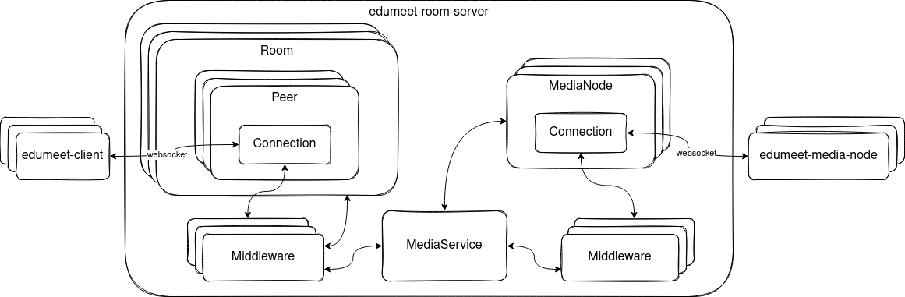

# Edumeet room server

This is the room server service for the Edumeet project.
It handles signaling to and from client and media node services.



## Usage

Make a file called `config.json` in the `/config` folder. An example configuration file with all properties set to default values can be found here:
[config.example.json](config/config.example.json)

### Docker

Running the service as a docker container.

```bash
$ docker build . -t user/edumeet-room-server
$ docker run -v $(pwd)/config:/usr/src/app/dist/config -p 8443:8443 -d user/edumeet-room-server
```

### Running the server manually

```bash
$ yarn install
$ yarn start
```

To run the server you need to have Node.js version 18 or higher installed. Alternatively you can get some debug output by running it like this:

```bash
$ DEBUG=edumeet-room-server:* yarn start
```

## Configuration properties

| Name | Description | Format | Default value |
| :--- | :---------- | :----- | :------------ |
| listenPort | Socket port to listen on | `"port"` | ``8443`` |
| listenHost | Ip/address the server will listen on | `"string"` | ``0.0.0.0``
| tls | TLS configuration for the server | `object` | ``{ "cert": "./certs edumeet-demo-cert.pem", "key": "./certs/edumeet-demo-key.pem"}`` |
| mediaNodes | Array of media nodes to use | `array` | ``[ { "host": "localhost", "port": 3000, "secret": "secret-shared-with-media-node" } ]`` |
---
