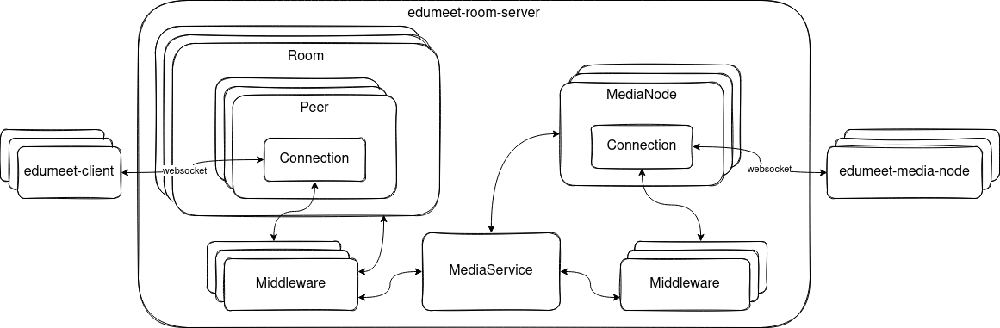

# Edumeet room server

This is the room server service for the Edumeet project.
It handles signaling to and from client and media node services.



## Usage

Make a file called `config.json` in the `/config` folder. An example configuration file with all properties set to default values can be found here:
[config.example.json](config/config.example.json)

Note that if you don't provide a value for `tls.cert` and `tls.key` the server will start in HTTP mode.

### Reverse proxy
We use geo position based on client ipv4 address when doing load balancing.
If you're running room-server service behind a reverse proxy, you need to forward client ipv4 address in http header `x-forwarded-for`.

As ipv6 is not supported in [the library we use for geoip lookup](https://github.com/geoip-lite/node-geoip), deploying edumeet using ipv6 is not recommend.

### Running the service manually

```bash
$ corepack enable
$ yarn install --immutable
$ MANAGEMENT_USERNAME=username MANAGEMENT_PASSWORD=password yarn start
```

To run the service you need to have Node.js version 24 or higher installed. This project uses Yarn 4 via Corepack. Alternatively you can get some debug output by running it like this:

```bash
$ DEBUG=edumeet:* yarn start
```

### Docker
https://github.com/edumeet/edumeet-docker/tree/main has guidelines for running all eduMEET-components as docker containers.
To build just edumeet-room-server you can use the included `./Dockerfile` here in this repo.

Edit and change password/username to use with management-server in `./Dockerfile` 

Building: 
```bash 
docker build . -t edumeet-room-server
```

Running: 
```bash 
docker run -v $(pwd)/config:/usr/src/app/config -p 8443:8443 -d edumeet-room-server
```
## Configuration properties

| Name | Description | Format | Default value |
| :--- | :---------- | :----- | :------------ |
| listenPort | Socket port to listen on | `"port"` | ``8443`` |
| listenHost | Ip/address the server will listen on | `"string"` | ``0.0.0.0``
| tls | TLS configuration for the server | `object` | ``{ "cert": "./certs edumeet-demo-cert.pem", "key": "./certs/edumeet-demo-key.pem"}`` |
| mediaNodes | Array of media nodes to use | `array` | ``[ { "host": "localhost", "port": 3000, "secret": "secret-shared-with-media-node", "latitude": 63.430481, "longitude": 10.394964, "country": "NO" } ]`` |
| managementService | Management service configuration | `object` | ``{	"host": "http://localhost:3030", "jwtPublicKeys": [	"-----BEGIN PUBLIC KEY-----\nMIICIjANBgkqhkiG9w0BAQEFAAOCAg8AMIICCgKCAgEAwO5DNSj3KSWpC4yFw0pP\nY6cmJPb3H6HzmbehugHMl+l0UFAr+eNeGKgXiKPFEGqWTMJg8mK72FNCLP+u/uBn\n8LhYOghIFUsiO9HZwEUH9rtN2L1nXOYKY/dckEVECMxjVnwsEilp+nV9AKncns7k\n37ERT+AhgmKYsIbZx8HL2KIsLEZhnZahTY2Iyw149hBzNFTwSKW9QssbPAL0RRl4\nydUHNnhMP21ElsQ0McQQae6C0bCejNMpiDFc0MqjzcnI4o0zH/nTIR68dNXTmZBa\nsoqvTsly3T9f3IkoDAd+NiYir4/4u43PlIrDB6RwMjsgjCKOrlLJoZFgcc2xORO5\nJTk8NKXg4AgTezs62izUz/kR90H/TXL87oiBQqIQ0XpDsiy5IPwkcUllv8f/q4oZ\n9wrV7/zdKTiHGI6OaIeNNYH726jTcUAadOzWuiyLAj99ki0ZZimUYwSPbZJ4NbHD\nFMVO/gAkTvuk0PZW1vsrqXdyFkuYk/2lUufrTYyOCDpyHE6GQuraC9qawsF/pL85\njolO9ea5zbVdBLAIThUDMvxp3c8sYuZfsapryiWqpcFokLJ/it6f/M9JFnL5WR0E\nY554QO73Qet5e/xXdTmqbFcqUcL1xQLHlPZsKjocEcPM7rXBLeUGxk7/OUPPgSaE\nM/ijCSi/4aqDk2lPSdzG1RsCAwEAAQ==\n-----END PUBLIC KEY-----\n" ] }`` |
| defaultRoomSettings | Default permissions for rooms | `"object"` | | 
| liveReload | live reload for prometheus exporter config | `"bool"` | | 
| prometheus | prometheus exporter for rooms | `"object"` | | 

---
# Configuration Reference (`config.json`)

This document describes all available configuration options in `config.json`, their purpose, and expected values.

---

## Root Configuration

### `liveReload`

```json
{
	"liveReload": false,
  ...
}
```

- **Type:** `boolean`
- **Default:** `false`
- **Description:**  
  Enables or disables live reload of the application when configuration files change.  
  Intended mainly for development environments. (currently only works with prometheus exporter)

---

## Prometheus Monitoring

### `prometheus`

Exposes Prometheus metrics when enabled.

```json
{
	"prometheus": {
		"enabled": false,
		"period": 10,
		"listener": [
			{
				"ip": "0.0.0.0",
				"port": 3080,
				"protocol": "http"
			},
			{
				"ip": "0.0.0.0",
				"port": 3043,
				"protocol": "https",
				"cert": {
					"cert": "./certs/edumeet-demo-cert.pem",
					"key": "./certs/edumeet-demo-key.pem"
				}
			}
		]
	},
  ...
}
```
#### `prometheus.enabled`

- **Type:** `boolean`
- **Default:** `false`
- **Description:**  
  Enables Prometheus metrics collection and exposure.

#### `prometheus.period`

- **Type:** `number`
- **Unit:** seconds
- **Default:** `10`
- **Description:**  
  Interval at which metrics are collected.

#### `prometheus.listener`

- **Type:** `array`
- **Description:**  
  List of network listeners used to expose Prometheus metrics.

##### Listener Object

| Field     | Type     | Description |
|----------|----------|-------------|
| `ip`     | `string` | IP address to bind to (e.g. `0.0.0.0`) |
| `port`   | `number` | Port to listen on |
| `protocol` | `string` | `http` or `https` |

##### HTTPS Listener – `cert`

Required when `protocol` is `https`.

| Field | Type | Description |
|------|------|-------------|
| `cert` | `string` | Path to TLS certificate file |
| `key`  | `string` | Path to TLS private key file |

---

## Server Settings

```json
	"listenPort": "8443",
	"listenHost": "0.0.0.0",
	"tls": {
		"cert": "./certs/edumeet-demo-cert.pem",
		"key": "./certs/edumeet-demo-key.pem"
	},
```

### `listenHost`

- **Type:** `string`
- **Default:** `0.0.0.0`
- **Description:**  
  Host or IP address the main server listens on.

### `listenPort`

- **Type:** `string`
- **Default:** `"8443"`
- **Description:**  
  Port used by the main server.  
  Stored as a string for flexible parsing.

---

## TLS Configuration

### `tls`

Defines TLS settings for the main server. (if not specified runs on http mode)

| Field | Type | Description |
|------|------|-------------|
| `cert` | `string` | Path to TLS certificate |
| `key`  | `string` | Path to TLS private key |

---

## Management Service

### `managementService`

Configuration for the external management/authentication service. (if not specified disabled)

#### `managementService.host`

- **Type:** `string`
- **Description:**  
  Base URL of the management service.

#### `managementService.jwtPublicKeys`

- **Type:** `array<string>`
- **Description:**  
  List of PEM-encoded public keys used to verify JWT tokens issued by the management service.

---

## Default Room Settings

### `defaultRoomSettings`

Defines default behavior and permissions for newly created rooms.
```json
	"defaultRoomSettings": {
			"defaultRole": {
					"name": "Default",
					"description": "Default role",
					"permissions": [
							{ "name": "CHANGE_ROOM_LOCK" },
							{ "name": "PROMOTE_PEER" },
							{ "name": "SEND_CHAT" },
							{ "name": "MODERATE_CHAT" },
							{ "name": "SHARE_AUDIO" },
							{ "name": "SHARE_VIDEO" },
							{ "name": "SHARE_SCREEN" },
							{ "name": "SHARE_EXTRA_VIDEO" },
							{ "name": "SHARE_FILE" },
							{ "name": "MODERATE_FILES" },
							{ "name": "MODERATE_ROOM" },
							{ "name": "LOCAL_RECORD_ROOM" },
							{ "name": "CREATE_ROOM" },
							{ "name": "CHANGE_ROOM" }
					]
			},
			"locked": false,
			"tracker": "wss://<trackerfqdn>/<path>/",
			"reactionsEnabled": false
	},
```

---

### Default Role

#### `defaultRoomSettings.defaultRole`

Describes the default role assigned to users.

| Field | Type | Description |
|------|------|-------------|
| `name` | `string` | Human-readable role name |
| `description` | `string` | Role description |
| `permissions` | `array` | List of permissions granted to the role |

##### Permissions

Each permission is an object with a `name` field.

Example permissions:

- `CHANGE_ROOM_LOCK`
- `PROMOTE_PEER`
- `SEND_CHAT`
- `MODERATE_CHAT`
- `SHARE_AUDIO`
- `SHARE_VIDEO`
- `SHARE_SCREEN`
- `SHARE_EXTRA_VIDEO`
- `SHARE_FILE`
- `MODERATE_FILES`
- `MODERATE_ROOM`
- `LOCAL_RECORD_ROOM`
- `CREATE_ROOM`
- `CHANGE_ROOM`

---

### Room Behavior

| Setting | Type | Description |
|-------|------|-------------|
| `maxActiveVideos` | `number` | Maximum number of active video streams |
| `locked` | `boolean` | Whether rooms are locked by default |
| `breakoutsEnabled` | `boolean` | Enables breakout rooms |
| `chatEnabled` | `boolean` | Enables chat functionality |
| `raiseHandEnabled` | `boolean` | Enables “raise hand” feature |
| `filesharingEnabled` | `boolean` | Enables file sharing |
| `localRecordingEnabled` | `boolean` | Enables local room recording |
| `tracker` | `string` | for file sharing |
| `maxFileSize` | `number` | filesize for fileshareing (100 is the default value - 100 MB )  |
| `endToEndEncryption` | `boolean` | Whether media in rooms is end-to-end encrypted by default. Requires a Chromium based browser; other browsers are refused entry to an encrypted room. |

#### `endToEndEncryption` precedence

A room's effective value is resolved as per-room setting, then tenant default, then this config
value, then `false`. Only an unset value falls through, so an explicit `false` at a higher level
stops the resolution there rather than deferring to this config.

In practice that means `defaultRoomSettings.endToEndEncryption` only applies to tenants that have
no `defaults` row in the management server, and to unmanaged deployments. Once a tenant default has
been saved in the management UI it always wins over this value, whether it was saved as on or off.

If a tenant sets `endToEndEncryptionLock`, the tenant value is forced and per-room settings are
ignored entirely.


---

## Media Nodes

### `mediaNodes`

- **Type:** `array`
- **Description:**  
  List of available media nodes used for audio and video processing.

```json
"mediaNodes": [{
		"hostname": "localhost",
		"port": 3000,
		"secret": "secret-shared-with-media-node",
		"latitude": 63.430481,
		"longitude": 10.394964,
		"country": "NO",
		"turnHostname": "localhost",
		"turnports" :  [
			{
				"protocol":"turn",
				"port": 80,
				"transport": "udp"
			},
			{
				"protocol":"turns",
				"port": 443,
				"transport": "tcp"
			}
		]
	}]
```

---

### Media Node Object

| Field | Type | Description |
|------|------|-------------|
| `hostname` | `string` | Media node hostname or IP |
| `port` | `number` | Media node control port |
| `secret` | `string` | Shared secret for authentication |
| `latitude` | `number` | Geographic latitude |
| `longitude` | `number` | Geographic longitude |
| `country` | `string` | ISO country code |
| `turnHostname` | `string` | TURN server hostname |

---

### TURN Ports

#### `mediaNodes[].turnports`

Defines TURN/TURNS listeners for NAT traversal.

##### TURN Port Object

| Field | Type | Description |
|------|------|-------------|
| `protocol` | `string` | `turn` or `turns` |
| `port` | `number` | Port number |
| `transport` | `string` | `udp` or `tcp` |

---

## Media Node Region Binding

The room server supports restricting which media nodes a given tenant's rooms may use, based on a coarse "region" grouping (e.g. `EEA`, `UA`). This is opt-in — deployments that don't mix regions can skip this whole section and the routing behaviour stays identical to before.

### `countryToRegion`

- **Type:** `object` (map of 2-letter ISO country code → region label or array of region labels)
- **Description:** Maps the `country` field of each media node to one or more region labels. Region labels are deployment-defined strings; the only requirement is that they match the values selected by super-admins in the management UI's tenant editor (see `knownRegions` in the client config).

A country may belong to **multiple regions** (e.g. Germany simultaneously in the wider EEA bucket and the narrower DACH bucket). Express it by giving the country an array of labels; tenants then choose which of those buckets they accept.

```json
"countryToRegion": {
	"DE": [ "EEA", "DACH" ],
	"AT": [ "EEA", "DACH" ],
	"CH": "DACH",
	"FR": "EEA",
	"PL": "EEA",
	"UA": "UA"
}
```

In the example above:
- An EEA-only tenant (`['EEA']`) sees DE, AT, FR, PL — but not CH (Switzerland is not in EEA) and not UA.
- A DACH-only tenant (`['DACH']`) sees DE, AT, CH — but not FR, PL, UA.
- A tenant with `['EEA','DACH']` would see DE, AT, CH, FR, PL.

The single-string form (`"FR": "EEA"`) is the convenience shorthand for `[ "EEA" ]`.

A country missing from this map (or mapped to an empty array) resolves to the internal region `OTHER` and is excluded from any region-limited tenant's candidate set. The server logs a warning at startup if any configured media node has such a country.

### `defaultAllowedMediaNodeRegions`

- **Type:** `array of strings`
- **Description:** Fallback region restriction applied when:
  - the room's tenant has no `allowedMediaNodeRegions` set, **or**
  - the room could not be resolved to a tenant (unmanaged deployment, or FQDN not present in the tenant DB).

When unset, those cases fall through to "no restriction" (every media node is eligible). Multi-region deployments (e.g. an EU + UA fleet) should set this to a safe baseline so that an unconfigured tenant cannot accidentally land on a non-baseline node.

```jsonc
// PCSS-style multi-region deployment: unmanaged / unknown tenants stay in EEA.
"defaultAllowedMediaNodeRegions": ["EEA"]
```

```jsonc
// Single-region deployment: leave empty (or omit the field entirely).
"defaultAllowedMediaNodeRegions": []
```

### Per-tenant override

In the management server, each tenant can have an `allowedMediaNodeRegions` array (managed via the tenant editor in the client). When set and non-empty, it overrides the deployment-level default for rooms belonging to that tenant.

## Client Monitoring

### `clientMonitoring`

- **Type:** `object`, optional
- **Description:** What the room server tells media nodes about a room, so that a node that stores client monitoring samples (see the media node README) can file them per tenant and room. By default it tells them nothing: a media node knows a room only by the random id of the room session. Whether clients send samples at all is a client setting (`clientMonitor.samplingPeriodInMs`), and display names in the samples are a client matter too (`obfuscateDisplayName`).

| Field | Type | Default | Description |
| :--- | :--- | :--- | :--- |
| `roomInfo` | `boolean` | `false` | Send every media node a room uses the tenant host (the host name the room's first participant joined on) and a label for the room. |
| `obfuscateRoomName` | `boolean` | `false` | With `roomInfo` on, label the room by its session id instead of its name, so room names, which people choose freely, never reach a media node or its sample storage. |

```json
"clientMonitoring": {
	"roomInfo": true,
	"obfuscateRoomName": true
}
```

Media nodes can be run by other organisations, which is why this is opt-in. It applies to end-to-end encrypted rooms like any other.

## Bots

A connection with `headless=1` in the query is a bot (a recorder, streamer or transcriber page). It is refused unless the room is open with at least one participant in it. Inside a tenant the room-server asks the management server's `bot-verify` service, sending the tenant, the bot token from the socket handshake `auth` payload (never from the URL) and the client address; the management server applies the tenant's bot policy, the token and its allowed address ranges. A management server without that service makes the room-server refuse every bot in a tenant, so upgrade the management server first. Outside a tenant, bots are admitted without a token.

A bot sends nothing but one thing: when the deployment collects client monitoring samples, a bot sends its samples like any client, over the one data channel a bot may open (`observertc-samples`, which goes to the media node and is never handed to another peer). Its samples carry `headless: true`, its `botType` and, for a job, the `jobId`, so the figures of a recorder are not read as a participant's. What they hold is the receiving side only: what the recorder actually got.

A bot records one session. A connection with `session=<breakout session id>` in the query is placed in that breakout room at join, whether or not anyone is in it yet; it is refused with `sessionNotOpen` when no such breakout room exists, and it is ended with `sessionClosed` when the breakout room is removed or ejected, while the participants are moved back to the main room as before. A moderator cannot move a bot between sessions. The join response carries the peer's actual `sessionId`.

The client address is the first entry of `x-forwarded-for`, or the socket address without a proxy. The proxy configuration shipped with edumeet-docker overwrites that header with the PROXY-protocol address for the room-server, so a client cannot supply it; a proxy that appends to the header instead must be configured to overwrite it, or the address ranges of the bot tokens cannot be trusted.

### Bot jobs

A tenant can let moderators start a recording, a live stream or a transcription from inside the
room. The work is done by an outside service, a **provider**, which the tenant configures in the
management server: one row per kind of job, holding the bot access token, the provider's https API
address and the API key it issued. The contract that service implements is
[BOT-PROVIDER-API.md](https://github.com/edumeet/edumeet/blob/main/BOT-PROVIDER-API.md).

The room-server reads its tenant's providers once, when the room is created, alongside the room
itself, and keeps them for as long as the room lives: later changes in the management server apply
to the next room. A failure to read them, an older management server without the `bot-providers`
service, a room outside a tenant, or a deployment without a management server all mean the same
thing, no providers, and then there is no job API and no buttons in the room. Nothing else about
bots changes: a bot started by hand works as before.

Requests, all of them needing `MODERATE_ROOM` and a signed-in peer (one with a `managedId`, since the
recording is delivered to people by their accounts): `moderator:startBotJob` with the job type and,
when the tenant has several providers of that type, which one; `moderator:stopBotJob` with the job id. A
job runs in the session the moderator was in when starting it, so a moderator in a breakout room
records that breakout room. Starting answers immediately with the job id and calls the provider
behind the answer. The participants of a session are told about its jobs with `botJobs`, and
moderators are told about a failure with `botJobFailed`; neither carries the provider's address or
key. A room runs at most 10 jobs at once.

The start call carries `room.mainSessionId`, the main room's session, on every job, the same for a
job in a breakout room of that meeting, so a provider can group the recordings of one meeting.
It also carries the people to tell about the recording: the owners of the room (known since
the room was created) and the moderator who started the job, resolved to addresses with one
`users.find` by id in the management server, each address once; a lookup that fails leaves the job
running without recipients. It also carries the tenant's `locale`, read with the tenant when the room
was created. A transcriber declares no video capability, so no video consumer is created for it.

The room-server calls a provider exactly twice per job, to start it and to stop it, and learns
everything in between from the bot's own connection: joining, the `botStatus` notification the page
sends, and leaving. Calls go over https with certificate validation, follow no redirect, give up
after 10 seconds, and never appear in the log. The job states are `starting`, `joined`, `running`,
`stopping`, `interrupted`, `ended` and `failed`, with the timers listed in the provider contract; a
failure is logged at info level with the room, the job, its type, the credential and the reason,
noting whether the bot reported it.

A bot page carries its job id in the query. Only a bot whose token the management server verified
may carry one, and only for a job started with that same credential. A job already finished is
refused with `jobNotActive`, as is a second page for a job whose browser is connected; a page that
reloads takes its job back over. A job id the room-server does not know, from a verified bot of one
of the room's providers, recreates the job: this is how jobs survive a restart of the room-server,
which for that reason never tells providers to stop when it shuts down.

## Notes

- All file paths are relative to the application working directory unless otherwise specified.
- TLS certificates must be valid and readable by the application.
- Media node secrets **must match** the configuration on the corresponding media node services.

